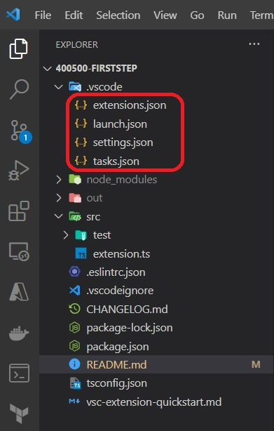
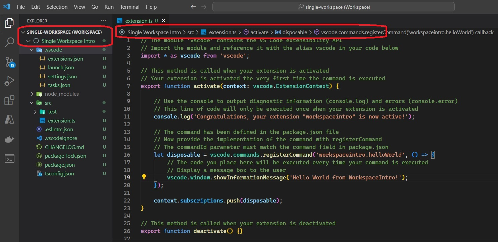
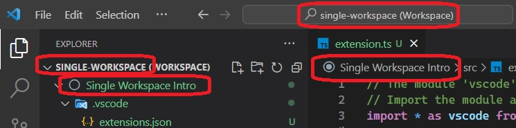
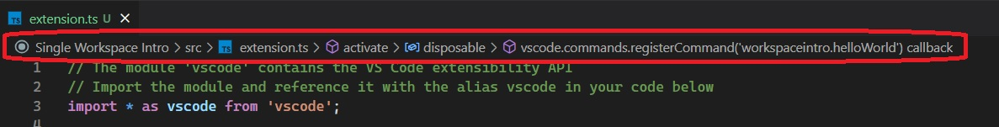

# Introduces workspace concept in Visual Studio Code

## References
1. [Workspaces](https://code.visualstudio.com/docs/editor/workspaces)
2. [Workspaces single folder](https://code.visualstudio.com/docs/editor/workspaces#_singlefolder-workspaces)
3. [Extension Guidelines](https://code.visualstudio.com/api/references/extension-guidelines)
4. [Visual Studio Code's Markdown Support](http://code.visualstudio.com/docs/languages/markdown)
5. [Markdown Syntax Reference](https://help.github.com/articles/markdown-basics/)


## How the app is built.
1. Follow the [steps here](https://code.visualstudio.com/api/get-started/your-first-extension)

2. The files in .vscode(see below) are also generated when you run `yo code` command

    

3. Need to understand the above files more.
4. Also removed the README.md and vsc-extension-quickstart.md files as they are not necessary for these examples.

## What's in the generated folder

1. This folder contains all of the files necessary for your extension.
2. `package.json` - this is the manifest file in which you declare your extension and command.
   1. The sample plugin registers a command and defines its title and command name. With this information VS Code can show the command in the command palette. It doesn’t yet need to load the plugin.
3. `src/extension.ts` - this is the main file where you will provide the implementation of your command.
   1.  The file exports one function, `activate`, which is called the very first time your extension is activated (in this case by executing the command). Inside the `activate` function we call `registerCommand`.
   2.  We pass the function containing the implementation of the command as the second parameter to `registerCommand`.


## How to run.
1. The first way is to directly open the exact folder in vscode which contains the source code, in this case 300500-WorkspaceIntro inside of apps folder. So you can run the following command.


```sh
code . src/extension.ts -r
```

The **-r** flag is optional. This will restart visual studio code. 
The second parameter is also optional, and this is a file that will be opened in VsCode once the VsCode is launched.

2. The second way is to open the workspace file **single-workspace.code-workspace**. So run the command such as 

```sh
code ./single-workspace.code-workspace ./src/extension.ts
```

   

3. Look at the following image. Where do the names come from?
 
   

Take a look at the following xml from the workspace file. The file name is single-workspace.code-workspace

```json
{
    "folders": [
        {
            // Source code
            "name": "Single Workspace Intro",
            "path": "../../apps/300500-WorkspaceIntro"
        }
    ]
}
```

So the `single-workspace` comes from the file name, while `Single Workspace Intro` comes from the inside of the file.
 

4. Once the workspace is opened along with the src/extension.ts in vscode, just press `F5` to open a new window with your extension loaded.
5. Run your command from the command palette by pressing (`Ctrl+Shift+P` or `Cmd+Shift+P` on Mac) and typing `Hello World`.
6. Set breakpoints in your code inside `src/extension.ts` to debug your extension.
7. Find output from your extension in the debug console.

## Make changes

1. You can relaunch the extension from the debug toolbar after changing code in `src/extension.ts`.
2. You can also reload (`Ctrl+R` or `Cmd+R` on Mac) the VS Code window with your extension to load your changes.

## Run tests

1. Open the debug viewlet (`Ctrl+Shift+D` or `Cmd+Shift+D` on Mac) and from the launch configuration dropdown pick `Extension Tests`.
2. Press `F5` to run the tests in a new window with your extension loaded.
3. See the output of the test result in the debug console.
4. Make changes to `src/test/suite/extension.test.ts` or create new test files inside the `test/suite` folder.
   1. The provided test runner will only consider files matching the name pattern `**.test.ts`.
   2. You can create folders inside the `test` folder to structure your tests any way you want.
  
## Go further

* [Follow UX guidelines](https://code.visualstudio.com/api/ux-guidelines/overview) to create extensions that seamlessly integrate with VS Code's native interface and patterns.
 * Reduce the extension size and improve the startup time by [bundling your extension](https://code.visualstudio.com/api/working-with-extensions/bundling-extension).
 * [Publish your extension](https://code.visualstudio.com/api/working-with-extensions/publishing-extension) on the VS Code extension marketplace.
 * Automate builds by setting up [Continuous Integration](https://code.visualstudio.com/api/working-with-extensions/continuous-integration).


## Explore the API
* You can open the full set of our API when you open the file `node_modules/@types/vscode/index.d.ts`.

## Notes
1. A Visual Studio Code "workspace" is the collection of one or more folders that are opened in a VS Code window (instance). 
2. In most cases, you will have a single folder opened as the workspace but, depending on your development workflow, you can include more than one folder, using an advanced configuration called [Multi-root workspaces](https://code.visualstudio.com/docs/editor/workspaces#_multiroot-workspaces).
3. Need to understand the following more.
   
   

4. Also need to uderstand the following as well.

   

5. 
